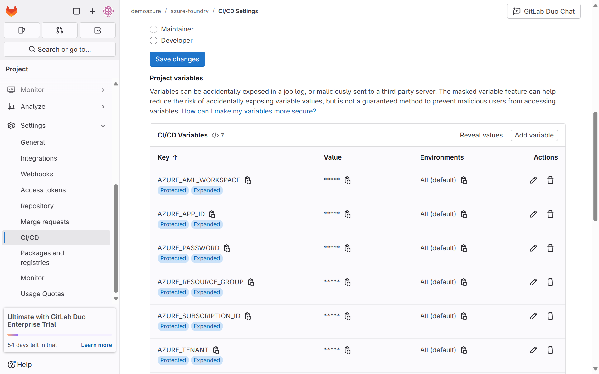
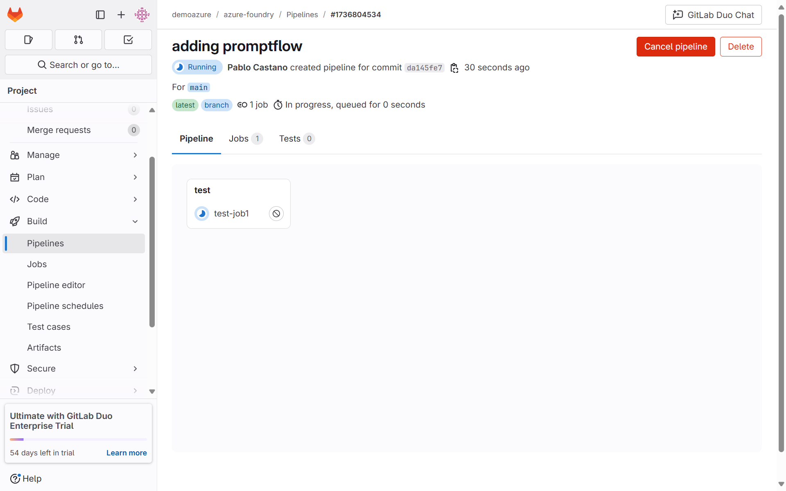
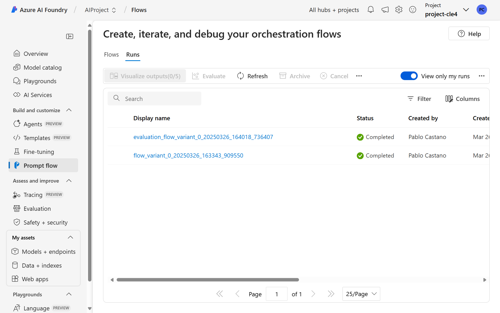

#  Gitlab Integation with Azure AI Foundry

This directory exemplifies the integration between Gitlab and Azure AI Foundry

## Instructions

1. **Python Environment Setup**
   ```bash
   python3.11 -m venv .venv
   source .venv/bin/activate  # On Windows: .venv\Scripts\activate
   pip install -r requirements.txt
   ```

2. **Create the infrastructure**
This sample uses [`azd`](https://learn.microsoft.com/azure/developer/azure-developer-cli/) and a bicep template to deploy all Azure resources:

   - Login to your Azure account: `azd auth login`

   - Create an environment: `azd env new`

   - Run `azd up`.

      + Choose your Azure subscription.
      + Enter a region for the resources.

      The deployment creates multiple Azure resources and runs multiple jobs. It takes several minutes to complete. The deployment is complete when you get a command line notification stating "SUCCESS: Your up workflow to provision and deploy to Azure completed."


3. **Trigger an evaluation pipeline from GitLab**
   - Create a service principal for the GitLab app using azure cli
      ```bash
      az ad sp create-for-rbac --name <your_service_principal_name> \
                              --role Contributor \
                              --scopes /subscriptions/<you_subscription_id>/resourceGroups/<your_resource_group>
      ```

   - Set the CI/CD Variables inside GitLab
      - AZURE_SUBSCRIPTION_ID : <your_azure_subscription_id> 
      - AZURE_RESOURCE_GROUP: <your_azure_resource_group> 
      - AZURE_AML_WORKSPACE: <your_azure_ai_foundry_project_name> 
      - AZURE_APP_ID: <your_azure_app_id> **
      - AZURE_PASSWORD: <your_azure_app_password> **
      - AZURE_TENANT: <your_azure_tenant_id> **

      
      
      ** Note: These can be found in the cli response from previous steps
 
   - Commit to gitlab and observe pipeline execution:
      

      - The pipeline triggers a run and an evaluation flow inside the Azure AI Foundry project:
      


4. **Delete the Resources**
  You can delete the infrastruture created before by using `azd down --purge`

